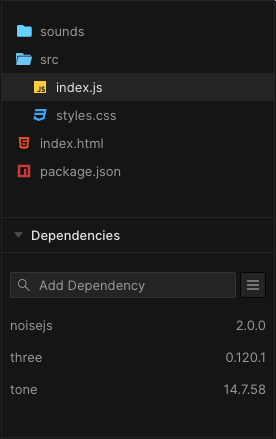

# Workshop 04 - mover
## Hello and welcome back!
This workshop is aimed at helping you understand how we can start to apply deterministic and non-deterministic algorithms to our objects moving in space, to create emergent audio-visual experiences. So, we will:
 - Work from the template we made from the second workshop
 - Create our second generative system where we will start to apply forces to moving objects to create patterns in visuals and sound
 - Experiment with creating sine wave patterns
 - Experiment with using noise to create more non-deterministic patterns

Here's what we're going to be building (let it play for a bit to work out what's going on here):

<iframe src="https://codesandbox.io/embed/cpc-w04-moverend-qc0few?fontsize=14&hidenavigation=1&theme=dark&view=preview"
     style="width:100%; height:500px; border:0; border-radius: 4px; overflow:hidden;"
     title="CPC_W04_moverEND"
     allow="accelerometer; ambient-light-sensor; camera; encrypted-media; geolocation; gyroscope; hid; microphone; midi; payment; usb; vr; xr-spatial-tracking"
     sandbox="allow-forms allow-modals allow-popups allow-presentation allow-same-origin allow-scripts"
   ></iframe>
	

**Where code is provided, you are expected to write it out yourself rather than copying and pasting it. We know this is tempting, but the point of a university education is for you to learn the necessary skills for your field, and copying and pasting code will not be on any job descriptions.**

## Task 1 - Importing Libraries and Declaring Our Variables

If you have reached here without completing workshops 1 2 and 3, please return to those as this is where we make the template that we start from on the following workshops.

Right, create a new codesandbox project using the final workshop 2 task as a template.

First of all, we're going to use the same timing code from workshop 3, which means initialising the following variables towards the top of the init() function:</p>
   
```javascript
// clock generator to ensure we can clamp some operations at different timed rates if needed
  clock = new THREE.Clock();
  delta = 0;
  interval = 1 / 2; // 2 fps
```

And then updating our update function as follows:

```javascript
function update() 
{
  orbit.update();
  //update stuff in here
  delta += clock.getDelta();

  if (delta  > interval) {
    // The draw or time dependent code are here
    delta = delta % interval;
  }
}
```

We're actually only adding this in case we need to print some stuff to our console to debug in this task. Turns out printing at 60fps AND animating AND making sound is quite hardcore for the browser to handle...

OK, in the explorer tab on the left hand, navigate to the dependencies search box. You should already be able to see that we have three as a dependency. Now we're going to add two more simply by searching for the names and selecting them. Let's add "tone" and "noisejs". So, your dependenices tab should look like this now:



At the very top of your index.js file where we import Three, let's also import Tone and Noisejs like so:
	
```javascript
import * as THREE from "three";
import * as Tone from "tone";
import { Noise } from "noisejs";
import { OrbitControls } from "three/examples/jsm/controls/OrbitControls.js";
import "./styles.css";
```

Please **delete all the sound making code where we read the sound file and play it with THREE.PositionalAudio** as we are now moving on to using Tone.js this week. For this workshop we'll be synthesising in the browser, rather than simply playing back audio files. 😀

We're going to declare some global variables **near the top of our index.js, before we define the init() function**. So, we've got the number of movers; a variable to hold a movers array which we'll use later, another variable for our synths array that we're going to make; and finally a variable to hold an array for our musical scale that we'll use to change the frequency of the synths:

```javascript
let numMovers, movers, synths;
let musicalScale;
```

And **in the init() function**, let's move our camera back on the Z axis a bit so we can see what's going on:

```
camera.position.z = 25;
```

Next, add a <a href="https://threejs.org/docs/#api/en/helpers/GridHelper" target="_blank">grid helper</a> to your scene.
    
## Task 2 - Our Mover Class

Just like last time with the random walker, we're going to create a class that holds all our data and encapsulates our functionality. This time we'll add an extra method called display(). Let's make this just below the init() function :

```javascript
class Mover {
	constructor() 
	{
		
	}

	update() 
	{
		
	}

	display() 
	{

	}
}
```

Again, just like the walker, we'll add some parameters to pass to the constructor. And in the constructor we'll set the position and create some vectors that we will use later for moving our movers around the space.

 - We're going to set the position
 - We're going to have an offset property too which will allow us to change the start point of our individual movers once we begin to move them
 - Our angle, velocity and amplitude vectors will be used when calculating our sine wave function later
 - Hopefully the geometry/material/box business is pretty familiar now 😀
 - And we're going to create an instance of noise for each mover which we will query later in the update function. We'll just seed the noise object with a random number so it generates different noise every time we run the piece.

```javascript
class Mover 
{
  constructor(x,y,z,offset) 
  {
    this.x = x;
    this.y = y;
    this.z = z;
    
    this.angle = new THREE.Vector3(0, offset, 0);
    this.velocity = new THREE.Vector3(0.1, 0.01, 0.01);
    this.amplitude = new THREE.Vector3(0.5, 2.5, 0.5);
    this.geo = new THREE.BoxGeometry(0.5, 0.5, 0.5);
    this.mat = new THREE.MeshPhongMaterial({
      color: new THREE.Color(0.2, 0.2, 0.2)
      });
    this.box = new THREE.Mesh(this.geo, this.mat);
    this.box.position.set(this.x, this.y, this.z);
    this.noise = new Noise();
    this.noise.seed(THREE.MathUtils.randFloat());
    scene.add(this.box);
  }

  update() 
  {
    this.angle.add(this.velocity);
  }

  display() 
  {
    this.box.position.set(this.x,this.y,this.z);
  }

}
```

Right,  let's initialise the global variables we made earlier. We'll have 36 rows of movers, then we'll create the blank arrays that we're going to fill. **(If you are running on an older machine, you might find you can only have numMovers of 18 or 24 here, because the audio side of things is quite CPU intensive)**. And finally let's create our musical scale array which will be used later to pick the frequencies that we're going to have each mover play. Do this **towards the bottom of init() before we call play()**,: 

```javascript
  numMovers = 36;
  movers = [];
  synths = [];
  musicalScale = [0, 4, 7, 11, 14];
```
	
## Task 3 - Creating a 2D Array of Movers

Now we're going to actually use our Mover class by using a 2 Dimensional array - an array of arrays! It will be a grid 36 boxes long and 18 wide. And we'll just set the x and z positions while leaving the y position at 0 as that is the thing that we'll be updating later. We will also leave the offset at 0 for now, just to demonstrate what happens when we change that:
    
We're going to make this towards the bottom of the init() function above the line where we call play()

Try creating your own two dimensional array of movers that have a the following initialisation arguments passed to them as they're created: `i - 10, 0, j - 5, 0`

<details markdown="1">
<summary>Don't worry if you're struggling, click the dropdown to see the solution</summary>

```javascript
  // make some movers
  for (let i = 0; i < numMovers; i++) {
    for (let j = 0; j < numMovers / 2; j++) {
      movers.push([]);
      movers[i].push(new Mover(i - 10, 0, j - 5, 0)); // no offset yet
    }
  }
```

</details>
       
OK so, not only do we need to create our movers, but we will also need to update them and display them using a for loop too. Let's change our update function to loop through all of our movers and update them:

```javascript
//our update function
function update() 
{
  orbit.update();
  //update stuff in here
  delta += clock.getDelta();

  if (delta > interval) 
  {
    // The draw or time dependent code are here
    delta = delta % interval;
  }

  for(let i = 0; i < numMovers; i++) {
		for (let j = 0;j < numMovers/2; j++){
			movers[i][j].update(); // update all movers
		}	
	}
}
```
  
The same is required for the mover display() function, which we call from render(), so let's update that as follows too:

```javascript
// our render function
function render() 
{
  for (let i = 0; i < numMovers; i++) {
    for (let j = 0; j < numMovers / 2; j++) {
      movers[i][j].display(); // display all movers
    }
  }
  renderer.render(scene, camera);
}
```

So now we have everything in place to start moving our movers around to create some nice patterns.

## Task 4 - Adding Oscillations and Noise
Right we have our grid layout, but nothing is moving yet. First of all, let's make our movers oscillate update and down using the sine function. With all the vectors that we create earlier and the in built javascript sine function, we can do this really easily by adding the following to our Mover class. Let's **add it BELOW the line where we add the velocity and angle vectors in the mover update() function**:

Check the slides / lecture recording to remind yourself of what the behaviour of a `sine` periodic function will be

```javascript
this.y = Math.sin(this.angle.y) * this.amplitude.y;
```

Now you should be able to see your movers doing something, but they're all moving in synchrony right?! That's not what we want, we want to address each row individually and move them to create a sine wave pattern. In order to do this, let's pop back to **where we create the movers in the init() function**. We're going to change that offset parameter and update it such that updates the y value of the angle vector:

```javascript
  // make some movers
  for (let i = 0; i < numMovers; i++) {
    for (let j = 0; j < numMovers / 2; j++) {
      movers.push([]);
      movers[i].push(new Mover(i - 10, 0, j - 5, i * 0.25));
    }
  }
```

OK, now we're cooking!

And from here, it's super easy to add a bit of *Perlin noise* that we talked about in the lecture too, for some extra generative behaviour. Let's **go back to the update() method of our Mover class**. We're just going to call the classic 2D perlin noise using our angle and amplitude as coordinates. Then we scale it a bit by multiplying it by 5. Finally we add that to our sine wave function and now we're really getting some interesting emergent patterns happening.

```javascript
 let perl = this.noise.perlin2(this.angle.y, this.amplitude.y) * 5;
 this.angle.add(this.velocity);
 this.y = Math.sin(this.angle.y) * this.amplitude.y + perl;
```

## Task 5 - Adding Sound

Right it's all very well making pretty visual patterns and that, but we're hear to make **audio visual art**. Let's just make sure Single Synth at top of init(), just below the bit where we get rid of the overlay. This will just let us test that our sound using Tone is working. I've added some comments to show what each line is doing:

```javascript
//sound
let synthy = new Tone.MonoSynth({ // declare synth and set some parameters
    oscillator: {
      type: "square" // set the oscillator type
    },
    envelope: {
      attack: 3 // fading in our sound over 3 seconds using a volume envelope 
    },
    filterEnvelope: { // attaching an envelope to our low pass filter
      attack: 3,
      decay: 3,
      sustain: 1,
    
    },
    filter: { // setting the frequency and resonance of our filter
      frequency: 20000,
      Q: 4
    }
  });

synthy.toDestination(); // connect to our output
synthy.triggerAttack(70, 0, 0.01); //trigger the attack envelope stage only
```

You should hear a fairly annoying sound fade in - and keep going. 😅 

We want to **delete that synth and start to do some more interesting stuff to create a sound scape following the movement of the visual elements**. We're going to:

 - Create a synth per row of our 2D grid of movers
 - Constrain the frequency of each synth to a note of our musical scale array as we loop through our for loop
 - Connect our synths to the master output
 - Trigger our synth to start making sound

```javascript
 // make some movers - groups of sound synths for each group of movers
 for (let i = 0; i < numMovers; i++) 
 {
    let octave = parseInt(i/12,10); // find our octave based on where we're at with our iteration of "i"
	let freq = 36 + (musicalScale[i%5] + (octave*12));// starting from base 36 (C2) pick a value to add from our musicalScale array then increase our octave to spread our scale
			synths.push(new Tone.MonoSynth({ // add a new synth to our synth array
				oscillator: {
					type: "sawtooth"
				},
				envelope: {
					attack: 0.01
				}
				
			}));
		synths[i].toDestination(); //connect our synth to the main output
		synths[i].triggerAttack(Tone.Frequency(freq, "midi")+Math.random(6),0,0.01); // trigger at our desired frequency with a bit of randomness to add "thickness" to the sound
    for (let j = 0; j < numMovers / 2; j++) {
      movers.push([]);

      movers[i].push(new Mover(i - 10, 0, j - 5, i * 0.25));
    }
  }
```

Now we've got a nice *crushed chord* going on, but we can take this further to map the movement of each row to the volume of our synth such that the pattern will then directly correlate to the rhythm of the audio being created. Essentially, we're modulating the amplitude to create rhythmic patterns.

It does get a little bit tricksy at this point because we have to do a few steps to translate the movement along the y axis into something that is usable as an audio paramter.

We're going to change **our update() function** so that: 
 - We take the y position of the the first row of each of the movers
 - Then map (using the Three js `mapLinear` function) that value to between -1 and +1  (we found this range gives the best results for fading the volume)
 - Despite mapping between -1 and 1, we actually only ever want our gain to go between the values of 0 and 1. 
 - So we use the Three js function `clamp` to constrain our values so that they will never go below 0 or above 1
 - Then we convert that value to something usable for Tone js using its built in function called `gainToDb`
 - And after all of that we set our synth volume using a tiny little ramp to prevent clicks from happening (60fps is a good visual frame rate, but you'll hear a 60hz stepping in audio unless we *interpolate* between the values to smooth them out)
 
```javascript
// our update function
function update() 
{
  orbit.update();
  //update stuff in here
  delta += clock.getDelta();

  for (let i = 0; i < numMovers; i++) {
    let boxPosMap = THREE.MathUtils.mapLinear( // map the mover's box position from world coordinates to between -1 and 1
      movers[i][0].box.position.y,
      -movers[i][0].amplitude.y / 10,
      movers[i][0].amplitude.y,
      -1,
      1
    );
    let boxPosMapClamp = THREE.MathUtils.clamp(boxPosMap, 0, 3); // ensure our newly mapped value never goes above 3 or below 0
    let boxPosGainTodB = Tone.gainToDb(boxPosMapClamp); // convert our mapped and constrained value to decibels
    synths[i].volume.linearRampTo(boxPosGainTodB, 0.01); // set the volume of our synth with the correctly calibrated value mapped from the box position
    for (let j = 0; j < numMovers / 2; j++) { //update our movers
      movers[i][j].update();
    }
  }

  if (delta > interval) {
    // The draw or time dependent code are here
    
    delta = delta % interval;
  }
}
```

Phew! That was a big step up wasn't it?... but now you can see how to create a pretty neat generative audio-visual system, well done! 😊

## Task 6 - Stretch Tasks
    
OK so hopefully now you have made your generative wave pattern sequencer type thing, leave it running for a while to see how the dynamic, rhythm and tonality change over time. Here are a few of stretch goals for you to work to really extend the knowledge you've developed so far:

- Change the geometry type to a different shape. Use <a href="https://threejsfundamentals.org/threejs/lessons/threejs-primitives.html" target="_blank">this list</a> to try and implement something a bit more interesting than a cube... 
- Try adding some <a href="https://dustinpfister.github.io/2018/04/16/threejs-fog/" target="_blank">fog effects</a> 
- Change the musical scale array to different integers to see how that can alter the tonality of the piece
- Try changing the y values in the amplitude and velocity vectors in the Mover class
- Add audio *signal processing effects* like <a href="https://tonejs.github.io/examples/reverb/" target="_blank">reverb</a> and <a href="https://tonejs.github.io/docs/14.7.33/FeedbackDelay" target="_blank">delay</a>
- Try and make multiple waves to get cross rhythms and more complex audio-visual structures?
- Fade master volume based on where the camera is
- Change the colour of the row depending on whether the volume is high or not

## That's it for this week
Super important final task: go to `file->export to .zip` in your codesandbox and download your project!

Remember "the cloud is just someone elses computer" - so it's critical to keep backups. Make sure you back up your work (and in well named folders so you can find it later). Download and save your mover work in a folder for "CPC week 4".
